# **Kubernetes - Rancher demo and Traefik deployment**

**Reference**
- [iamapinan / kubeplay-traefik](https://github.com/iamapinan/kubeplay-traefik)
- [Itarun Pitimon / myKube Ep9 Kubernetes install on windows minikube](https://youtu.be/g-9H2urCSVY)

**WakaTime - Kube**
- [https://wakatime.com/@spcn26/projects/msqzcevomf](https://wakatime.com/@spcn26/projects/msqzcevomf)

**URL for Local testing**
- https://traefik.spcn26.local/dashboard/ - for traefik revProxy

- https://web.spcn26.local/ - for rancher/hello-world

**Operating System**
- Windows 11 Professional Edition - 2H22 Version

---

## **Step for preparing tools**

<details open>
    <summary><a href="kubectl">kubectl</a></summary>

1. Open a command prompt (cmd) and go to path > C:/kubectl

2. Run the command to install kubectl on your computer by following below.

```ruby
curl.exe -LO "https://dl.k8s.io/release/v1.26.0/bin/windows/amd64/kubectl.exe"
```
3. Go to "Edit environment variables for your account" by searching for it in the start menu
<div align="center">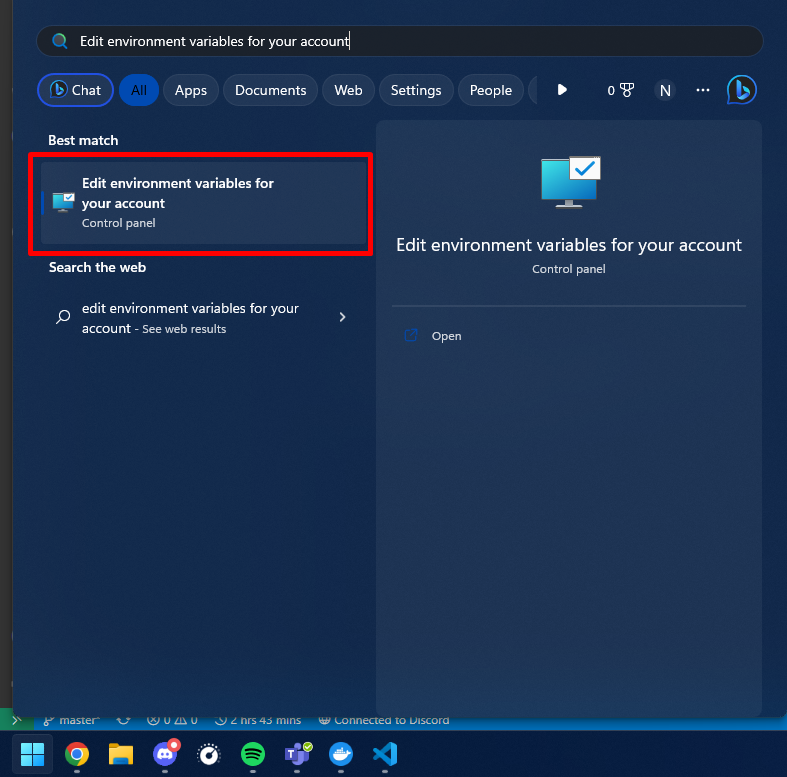</div>

4. Then click "Environment Variables..." button to set kubectl path.
<div align="center">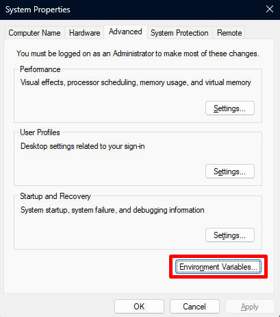</div>

5. Click "Path" on number 1 and click "Edit" button on number 2.
<div align="center">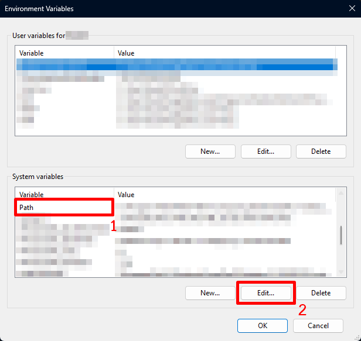</div>

6. Click "New" button on number 1 and add the path "C:/kubectl" on number 2 then click "OK" to save the path.
<div align="center">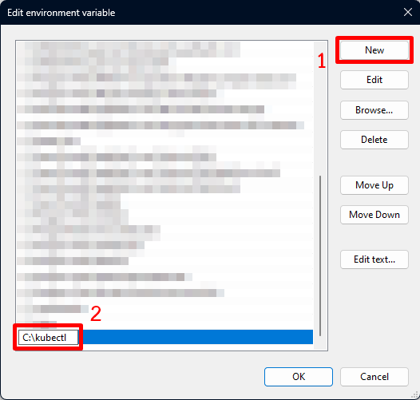</div>

7. Make sure **kubectl** is successfully installed by running the command below.

```ruby
kubectl version --client
```
<div align="center">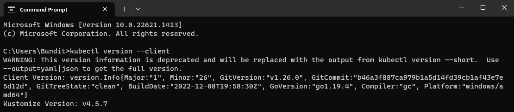</div>

**Ref.** - *https://kubernetes.io/docs/tasks/tools/install-kubectl-windows/*

</details>

<details>
    <summary>Minikubes</summary>

1. Download **minikube** using the command below in **PowerShell**.

```ruby
New-Item -Path 'c:\' -Name 'minikube' -ItemType Directory -Force
Invoke-WebRequest -OutFile 'c:\minikube\minikube.exe' -Uri 'https://github.com/kubernetes/minikube/releases/latest/download/minikube-windows-amd64.exe' -UseBasicParsing
```

2. Add the minikube.exe binary to your path using the command below in **PowerShell as Administrator**.
```ruby
$oldPath = [Environment]::GetEnvironmentVariable('Path', [EnvironmentVariableTarget]::Machine)
if ($oldPath.Split(';') -inotcontains 'C:\minikube'){ `
  [Environment]::SetEnvironmentVariable('Path', $('{0};C:\minikube' -f $oldPath), [EnvironmentVariableTarget]::Machine) `
}
```
3. Then a terminal (PowerShell) restart is required.

**Or you can be downloaded as an executable file for easier installation. (Easy step)**
<div align="center">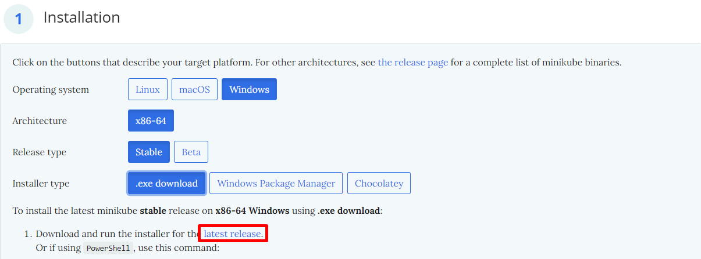</div>

**Ref.** - *https://minikube.sigs.k8s.io/docs/start/*
</details>

<details>
    <summary>Windows Subsystem for Linux (WSL)</summary>

1. Go to "Turn Windows features on or off" by searching for it in the start menu.
<div align="center">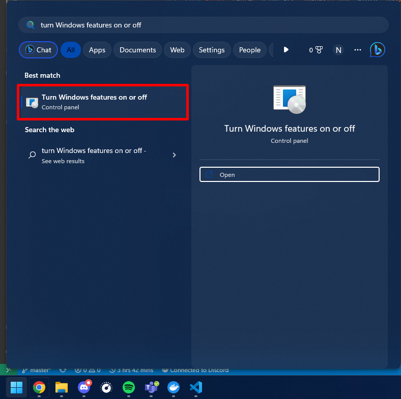</div>

2. Select the checkbox labeled "Windows Subsystem for Linux".
<div align="center">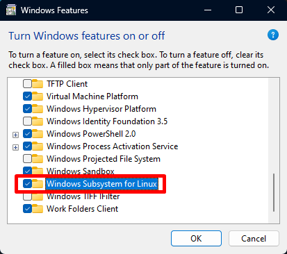</div>

3. Click "OK" button and wait the process. After finished, restart the device once.

4. After the device turned on, run the command prompt (cmd) and run the command below to update Windows Subsystem for Linux (WSL).

```ruby
wsl --update
```

5. Check for the latest version using the same command.
<div align="center">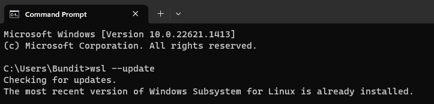</div>

6. Run the command below to make sure WSL is available.

```ruby
bash
```

**For bash command not responding, Change the default Linux distribution installed using the command to find the list of valid distributions that can be installed**

```ruby
wsl --list --online
```

**Then use the commands to install and set defaults for your Linux distribution.**

```ruby
#install a different linux distribution
wsl --install -d <NAME>
#check a list of installed linux distribution
wsl --list
#set the default linux distribution
wsl --set-default-version <NAME>
```

**Ref.** - *https://learn.microsoft.com/en-us/windows/wsl/install*
</details>

<details>
    <summary>Docker Desktop</summary>

**Go to the website below to download "Docker Desktop". After successful installation, try using the program.**
- https://www.docker.com/products/docker-desktop/

</details>

---

## **Step for deployment**

<details>
    <summary>Cluster and dashboard preparation</summary>

- Start and create a new cluster using minikube in docker on command prompt (cmd).
```
minikube start --driver=docker
```
- Check the pods on the cluster.
```
kubectl get pods -A
```
<div align="center">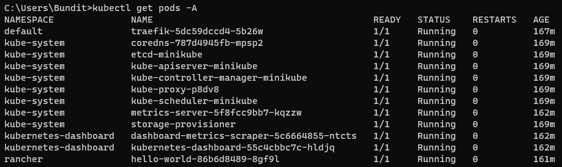</div>

- Check the nodes on the cluster.
```
kubectl get nodes
```

<div align="center"></div>

- Open kubernetes dashboard.

```
minikube dashboard
```

<div align="center">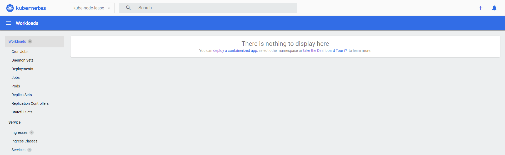</div>

</details>

<details>
    <summary>Traefik deployment</summary>

1. Download Helm for windows ([Windows amd64](https://get.helm.sh/helm-v3.11.2-windows-amd64.zip)) in the link : https://github.com/helm/helm/releases

2. Extract the files into "C:/helm" and set the path environment. (You can follow instructions similar to installing kubectl. > [Click here](#kubectl))

</details>