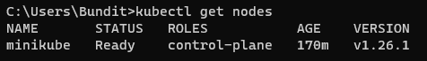

# **Kubernetes - Rancher demo and Traefik deployment**

**Reference**
- [iamapinan / kubeplay-traefik](https://github.com/iamapinan/kubeplay-traefik)
- [Itarun Pitimon / myKube Ep9 Kubernetes install on windows minikube](https://youtu.be/g-9H2urCSVY)
- [rancher / hello-world](https://github.com/rancher/hello-world)
- [traefik / traefik](https://github.com/traefik/traefik/blob/master/docs/content/routing/providers/kubernetes-crd.md)

**WakaTime - Kube**
- [https://wakatime.com/@spcn26/projects/msqzcevomf](https://wakatime.com/@spcn26/projects/msqzcevomf)

**URL for Local testing**
- https://traefik.spcn26.local/dashboard/ - for traefik revProxy

- https://web.spcn26.local/ - for rancher/hello-world

**Operating System**
- Windows 11 Professional Edition - 2H22 Version

---

## **Step for preparing tools**

<details open>
    <summary><a name="kubectl">kubectl</a></summary>

1. Open a command prompt (cmd) and go to path > C:/kubectl

2. Run the command to install kubectl on your computer by following below.

```ruby
curl.exe -LO "https://dl.k8s.io/release/v1.26.0/bin/windows/amd64/kubectl.exe"
```
3. Go to "Edit environment variables for your account" by searching for it in the start menu
<div align="center"></div>

4. Then click "Environment Variables..." button to set kubectl path.
<div align="center"></div>

5. Click "Path" on number 1 and click "Edit" button on number 2.
<div align="center"></div>

6. Click "New" button on number 1 and add the path "C:/kubectl" on number 2 then click "OK" to save the path.
<div align="center"></div>

7. Make sure **kubectl** is successfully installed by running the command below.

```ruby
kubectl version --client
```
<div align="center"></div>

**Ref.** - *https://kubernetes.io/docs/tasks/tools/install-kubectl-windows/*

</details>

<details>
    <summary>Minikubes</summary>

1. Download **minikube** using the command below in **PowerShell**.

```ruby
New-Item -Path 'c:\' -Name 'minikube' -ItemType Directory -Force
Invoke-WebRequest -OutFile 'c:\minikube\minikube.exe' -Uri 'https://github.com/kubernetes/minikube/releases/latest/download/minikube-windows-amd64.exe' -UseBasicParsing
```

2. Add the minikube.exe binary to your path using the command below in **PowerShell as Administrator**.
```ruby
$oldPath = [Environment]::GetEnvironmentVariable('Path', [EnvironmentVariableTarget]::Machine)
if ($oldPath.Split(';') -inotcontains 'C:\minikube'){ `
  [Environment]::SetEnvironmentVariable('Path', $('{0};C:\minikube' -f $oldPath), [EnvironmentVariableTarget]::Machine) `
}
```
3. Then a terminal (PowerShell) restart is required.

**Or you can be downloaded as an executable file for easier installation. (Easy step)**
<div align="center"></div>

**Ref.** - *https://minikube.sigs.k8s.io/docs/start/*
</details>

<details>
    <summary>Windows Subsystem for Linux (WSL)</summary>

1. Go to "Turn Windows features on or off" by searching for it in the start menu.
<div align="center"></div>

2. Select the checkbox labeled "Windows Subsystem for Linux".
<div align="center"></div>

3. Click "OK" button and wait the process. After finished, restart the device once.

4. After the device turned on, run the command prompt (cmd) and run the command below to update Windows Subsystem for Linux (WSL).

```ruby
wsl --update
```

5. Check for the latest version using the same command.
<div align="center"></div>

6. Run the command below to make sure WSL is available.

```ruby
bash
```

**For bash command not responding, Change the default Linux distribution installed using the command to find the list of valid distributions that can be installed**

```ruby
wsl --list --online
```

**Then use the commands to install and set defaults for your Linux distribution.**

```ruby
#install a different linux distribution
wsl --install -d <NAME>
#check a list of installed linux distribution
wsl --list
#set the default linux distribution
wsl --set-default-version <NAME>
```

**Ref.** - *https://learn.microsoft.com/en-us/windows/wsl/install*
</details>

<details>
    <summary>Docker Desktop</summary>

**Go to the website below to download "Docker Desktop". After successful installation, try using the program.**
- https://www.docker.com/products/docker-desktop/

</details>

---

## **Step for deployment**

<details>
    <summary>Cluster and dashboard preparation</summary>

- Start and create a new cluster using minikube in docker on command prompt (cmd).
```
minikube start --driver=docker
```
- Check the pods on the cluster.
```
kubectl get pods -A
```
<div align="center"></div>

- Check the nodes on the cluster.
```
kubectl get nodes
```

<div align="center"></div>

- Open kubernetes dashboard.

```
minikube dashboard
```
<div align="center"></div>

<div align="center"></div>

</details>

<details>
    <summary>Traefik deployment</summary>

1. Download Helm for windows ([Windows amd64](https://get.helm.sh/helm-v3.11.2-windows-amd64.zip)) in the link : https://github.com/helm/helm/releases

2. Extract the files into "C:/helm" and set the path environment. (You can follow instructions similar to installing kubectl in number 3-6. > [Click here](#kubectl))


3. Open a command prompt (cmd) in your workspace folder. And install traefik resource definitions (CRD) using command below.

```ruby
kubectl apply -f https://raw.githubusercontent.com/traefik/traefik/v2.9/docs/content/reference/dynamic-configuration/kubernetes-crd-definition-v1.yml
```

4. Install RBAC for Traefik using command below.

```ruby
kubectl apply -f https://raw.githubusercontent.com/traefik/traefik/v2.9/docs/content/reference/dynamic-configuration/kubernetes-crd-rbac.yml
```

5. Install Traefik Helmchart via Helm.

```ruby
helm repo add traefik https://traefik.github.io/charts #add traefik to own cluster
helm repo update #update the traefik files from the repository
helm install traefik traefik/traefik #install traefik to own cluster
```
6. Make sure services and pods are running.

```ruby
kubectl get svc -l app.kubernetes.io/name=traefik
kubectl get po -l app.kubernetes.io/name=traefik
```

7. Run the command below for use the linux commands on command prompt (cmd).
```ruby
bash
```

8. Create a secrete authentication

```ruby
htpasswd -nB <userName> | tee auth-secret
```
>**htpasswd** is used to create and update the flat-files used to store usernames and password for basic authentication of HTTP users.
**-n** is used to display the results.
**-B** is used to bcrypt encryption for passwords.
**tee auth-secret** is used to copy htpasswd text to create a file named "auth-secret".

9. Dry run to create a secret deployment.

```ruby
kubectl create secret generic -n <namespace> dashboard-auth-secret \
--from-file=users=auth-secret -o yaml --dry-run=client | tee dashboard-secret.yaml
```
> in the namespace, "traefik" is by default.

This will automatic create a deployment file "dashboard-secret.yaml" on your workspace folder.

```yaml
apiVersion: v1
data:
  users: c3BjbjI2OiQyeSQwNSRjUGRERWZ2Z3pZSUtkY1MyUlhWd0YuYnJRaTNuaHRISlBrWEh4WVBwbTFoVUFZY3BTQ3Z1cQoK #copy this section
kind: Secret
metadata:
  creationTimestamp: null
  name: dashboard-auth-secret
  namespace: traefik
```

10. After that, Copy users secret from "dashboard-secret.yaml" and replace in ["traefik-dashboard.yaml"](https://github.com/Nestlae/Kube/blob/master/traefik-dashboard.yaml)

```yaml
#create middleware named dashboard-auth-secret
apiVersion: traefik.containo.us/v1alpha1
kind: Middleware
metadata:
  name: traefik-basic-authen
  namespace: default #namespaces that you previously deployed, if nothing changes before (in number 9 commend). use the default
spec:
  basicAuth:
    secret: dashboard-auth-secret
    removeHeader: true
---
#deploy the secret that we use for authentication
apiVersion: v1
data:
  users: c3BjbjI2OiQyeSQwNSRjUGRERWZ2Z3pZSUtkY1MyUlhWd0YuYnJRaTNuaHRISlBrWEh4WVBwbTFoVUFZY3BTQ3Z1cQoK #paste an users secret here
kind: Secret
metadata:
  name: dashboard-auth-secret
  namespace: default
---
#define routing to traefik that if we go to the domain name "traefik.spcn26.local". It will send the request to api@internal, but in the middlewares part requires basic authentication first.
apiVersion: traefik.containo.us/v1alpha1
kind: IngressRoute
metadata:
  name: traefik-dashboard
  namespace: default
  annotations:
    kubernetes.io/ingress.class: traefik
    traefik.ingress.kubernetes.io/router.middlewares: traefik-basic-authen
spec:
  entryPoints:
    - websecure #https entrypoint
  routes:
    - match: Host(`traefik.spcn26.local`) && (PathPrefix(`/dashboard`) || PathPrefix(`/api`))
      kind: Rule
      middlewares:
        - name: traefik-basic-authen
          namespace: default
      services:
        - name: api@internal
          kind: TraefikService
```

11. Enable traefik dashbaord and start LoadBalance on minikube using below commands.

```ruby
kubectl apply -f traefik-dashboard.yaml #deploy traefik dashboard
minikube tunnel #start loadbalance
```

<div align="center"></div>

12. Determine the domain name by going to the file path below and opening it with Notepad (Run as administrator).

```yaml
C:\Windows\System32\drivers\etc\hosts
#ex. EXTERNAL-IP traefik.spcn26.local 
```
> EXTERNAL-IP means Traefik's external IP. It's from using command `kubectl get svc`

<div align="center"></div>

13. Save the host file and try the website : https://traefik.spcn26.local/dashboard/

<div align="center"></div>

> The username and password come from establishing a secret authentication. (in number 8)

14. It will show the traefik dashboard if you done it right.

<div align="center"></div>

**Ref** - *https://github.com/iamapinan/kubeplay-traefik*

</details>

<details>
    <summary>rancher/hello-world deployment</summary>

**Before starting instruction, If you want to change the namespaces. Run the command below.**

```ruby
kubectl create namespace <namespace> #create a new namespace
kubectl config set-context --current --namespace=<namespace> #set the namespace as default
```

1. Create ["rancher-deployment.yaml"](https://github.com/Nestlae/Kube/blob/master/rancher-deployment.yaml) for rancher application deployment.

```yaml
apiVersion: apps/v1 #in apiVersion v1beta1 and v1beta2 are not supported in kubernetes
kind: Deployment #deployment part
metadata:
  labels:
    app: hello-world
  name: hello-world
  namespace: rancher #namespace that you want to install an application
spec:
  replicas: 1 #number of containers which can be run
  selector: #pod selector 
    matchLabels: #pod label
      app: hello-world
  template:
    metadata:
      labels:
        app: hello-world
    spec: #pod specification
      containers: #build container
      - image: rancher/hello-world #image for build a container
        name: hello-world
        ports:
        - containerPort: 80 #container port specification
          protocol: TCP 
---
#service part
#create a service and set the selector to hello-world app using port 80
apiVersion: v1
kind: Service
metadata:
  name: hello-world #service name
  namespace: rancher
spec:
  ports:
  - port: 80 #port running on host
    protocol: TCP #service protocol
    targetPort: 80 #port running on container
  selector:
    app: hello-world
```
> **Ref** : *https://github.com/rancher/hello-world*

2. Create ["rancher-ingress.yaml"](https://github.com/Nestlae/Kube/blob/master/rancher-ingress.yaml) for rancher application deployment routing.

```yaml
apiVersion: traefik.containo.us/v1alpha1
kind: IngressRoute #define an object for routing setup
metadata:
  name: traefik-ingress
  namespace: rancher
spec:
  entryPoints: #define accessible protocols
    - web #http - 80
    - websecure #https - 443/SSL
  routes:
  - match: Host(`web.spcn26.local`) #domain
    kind: Rule
    services:
    - name: hello-world #routing to the name service "hello-world" when accessing the domain
      port: 80 # in port 80
```

> **Ref** : *https://github.com/iamapinan/kubeplay-traefik*

3. Deploy rancher application, services, routing using below commands.

```ruby
kubectl apply -f rancher-deployment.yaml #deploy rancher app and rancher services
kubectl apply -f rancher-ingress.yaml #deploy rancher routing
```

4. Determine the domain name by going to the file path below and opening it with Notepad (Run as administrator).

```yaml
C:\Windows\System32\drivers\etc\hosts
#ex. EXTERNAL-IP web.spcn26.local 
```
> EXTERNAL-IP means rancher application's external IP. It's from using command `kubectl get svc`

<div align="center"></div>

5. Save the host file and try the website : https://web.spcn26.local/

<div align="center"></div>

</details>

---
## **Result**

<details>
    <summary>Kubernetes dashboard (minikube)</summary>

**URL Local** : http://127.0.0.1:60905/api/v1/namespaces/kubernetes-dashboard/services/http:kubernetes-dashboard:/proxy/

<div align="center"></div>

<div align="center"></div>

</details>

<details>
    <summary>Traefik dashboard</summary>

**URL Local** : https://traefik.spcn26.local/dashboard/

<div align="center"></div>

</details>

<details>
    <summary>Rancher application</summary>

**URL Local** : https://web.spcn26.local/ 

<div align="center"></div>

</details>